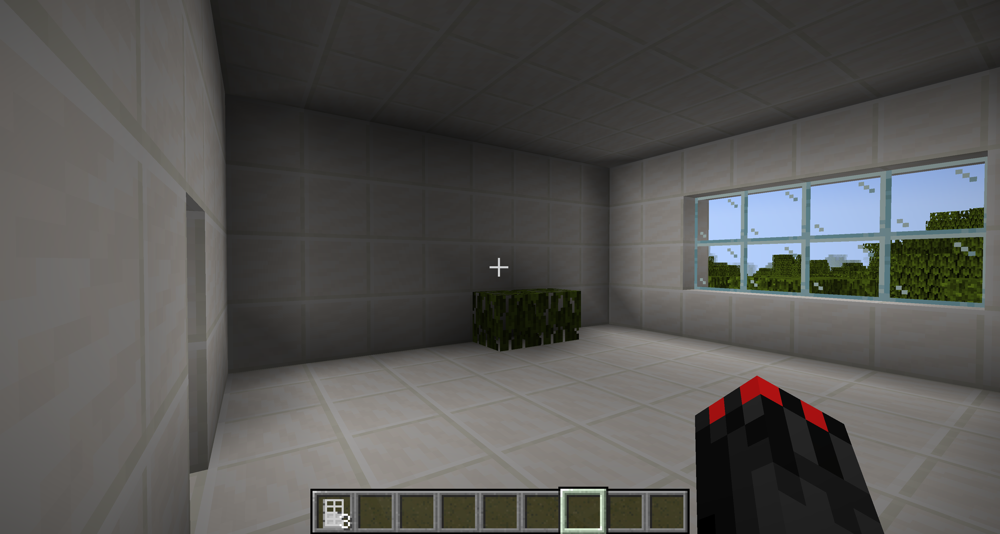
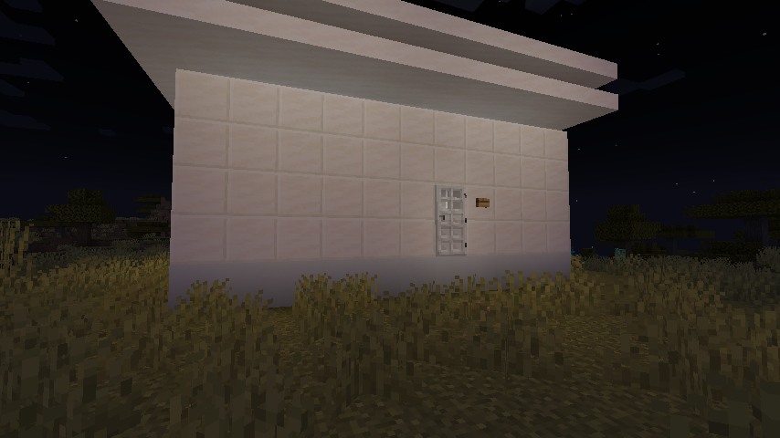
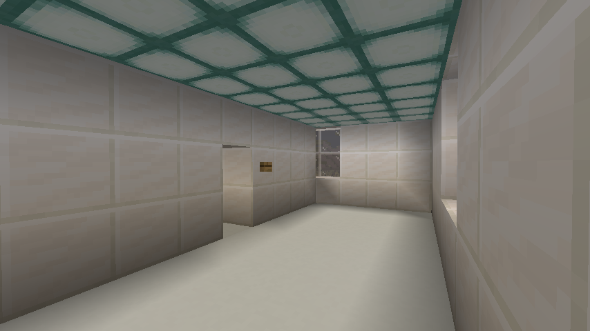
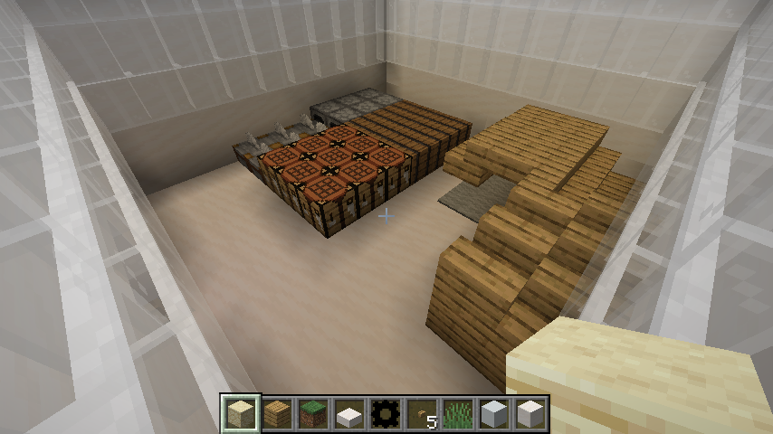
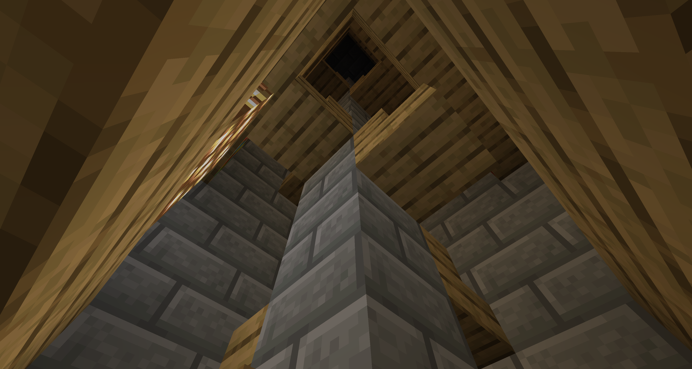
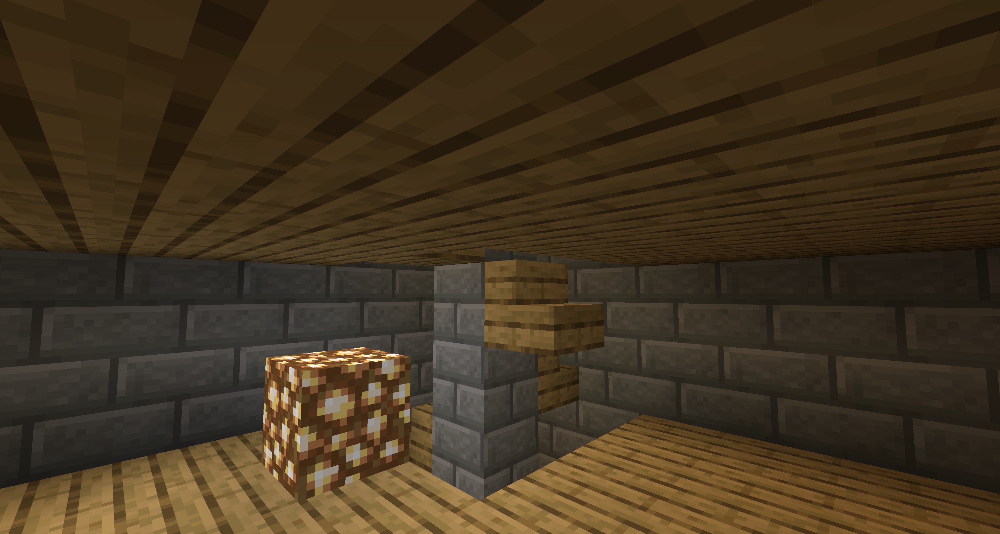

# AiCraft - AI in Minecraft

AiCraft is a Minecraft mod that brings AI functionality directly into your Minecraft world. Use AI assistants to analyze your surroundings, get help with building, answer questions about the game, and even execute commands based on natural language prompts.

## Features

- **AI Chat Assistant**: Ask the AI questions about Minecraft and get helpful responses
- **World Analysis**: Have the AI analyze chunks and surroundings in your world
- **Command Generation**: Use natural language to have the AI generate and execute Minecraft commands
- **Customizable Settings**: Configure your AI model and preferences through in-game settings

## Screenshots

 

 

 

 

 

## Commands

- `/ai ask <prompt>` - Ask the AI a question
- `/ai analyze <prompt>` - Analyze the current chunk with a specific prompt
- `/ai usecommands <prompt>` - Have the AI generate and execute commands based on your request
- `/ai tokenSet` - Open settings to configure your AI model
- `/ai reset` - Reset the AI conversation context

## Installation

1. Make sure you have Minecraft 1.21 and Forge 51.0.33+ installed
2. Download the latest release of AiCraft
3. Place the mod JAR file in your Minecraft `mods` folder
4. Launch Minecraft with the Forge profile
5. Configure your AI settings using `/ai tokenSet` in-game

## Development Setup

### Prerequisites
- Java Development Kit (JDK) 17 or higher
- Gradle (included via wrapper)

### Setup Instructions

**For Eclipse:**
1. Run `./gradlew genEclipseRuns`
2. Import the project: File > Import > Existing Gradle Project
3. Select the project folder

**For IntelliJ IDEA:**
1. Open IDEA and import the project
2. Select the `build.gradle` file
3. Run `./gradlew genIntellijRuns`
4. Refresh the Gradle project if needed

### Common Gradle Commands

- `./gradlew build` - Build the mod
- `./gradlew runClient` - Run Minecraft with the mod loaded
- `./gradlew --refresh-dependencies` - Refresh dependencies
- `./gradlew clean` - Clean build artifacts

## License

All Rights Reserved

## Credits

Created by K754a

## Additional Resources

- [Minecraft Forge Documentation](https://docs.minecraftforge.net/en/latest/gettingstarted/)
- [Forge Forums](https://forums.minecraftforge.net/)
- [Forge Discord](https://discord.minecraftforge.net/)
